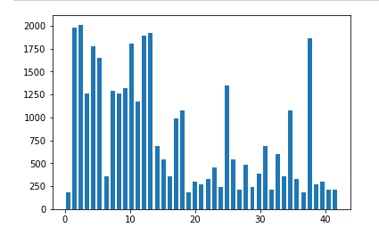
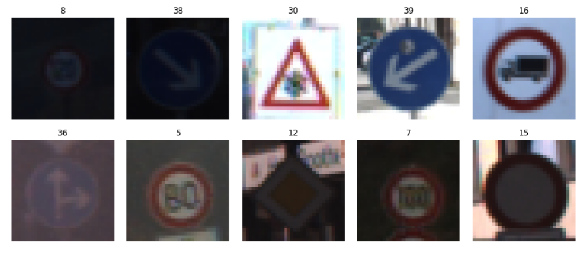
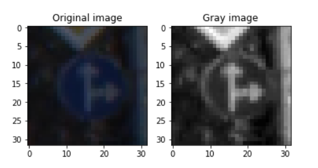
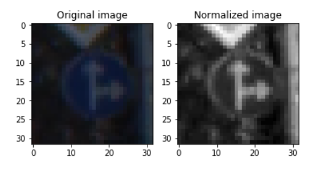
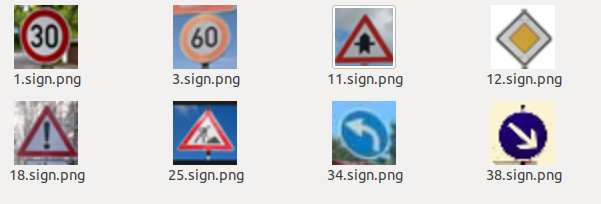
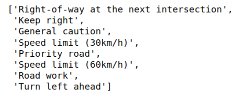
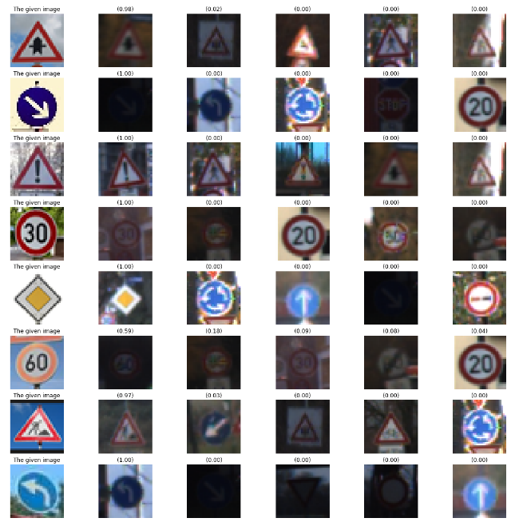

### P3_Traffic_sign_classifier

The goals / steps of this project are the following:
- Load the data set
- Explore, summarize and visualize the data set 
- Design, train and test a model architecture 
- Use the model to make predictions on new images 
- Analyze the softmax probabilities of the new images 
- Summarize the results with a written report 

### Description
Jupyter notebook Project_Traffic_Sign_Classifier_V1.ipynb contains the source code, the Project Report.html describe the result of each step of the traffic sign classifier.  The training data are located  in traffic_signs_data/ directory; however, Udacity advise us do not to include the data; the folder will be empty. The test images is located in testdata/ folder. 

### 1. Data Set Summary & Exploration

The data set can be downloaded by using the following link:
https://s3-us-west-1.amazonaws.com/udacity-selfdrivingcar/traffic-signs-data.zip

After downloading, pleae put test.p, train.p and valid.p under traffic_signs_data/ folder. 

1. I used the pandas library to calculate summary statistics of the traffic signs data set:
- The size of training set is 34799
- The size of the validation set is 4410
- The size of test set is 12630
- The shape of a traffic sign image is (34799, 32, 32, 3)
- The number of unique classes/labels in the data set is 43

2. Here is an exploratory visualization of the data set. It is a bar chart showing how the histogram of label frequency

And here are images for visualization of the dataset:

### 2. Design and Test a Model Architecture

2.1 Image Processing

As a first step, I decided to convert the images to grayscale. Here is an example of a traffic sign image before and after grayscaling.

The second step is to normalized the images. The suggest value was (pixel - 128)/ 128, but after a couples of trials, the result will be better when the data is normalized by (pixel)/ 255. Here is an example of normalized image.

2.2 Model Architecture

My final model consisted of the following layers:

    
 
2.3 Trained model

I used the Adam optimizer. The final settings used were:
- batch size: 64 
- epochs: 12 
- learning rate: 0.001 
- mu: 0 
- sigma: 0.1 
- dropout keep probability: 0.5 

2.4 Final model result

My final model results were:
- training set accuracy : 0.990
- validation set accuracy : 0.965
- test set accuracy : 0.947

### 3. Test a Model on New Images

Here are five German traffic signs that I found on the web:

And the test reslut:

 
For these test images, the accuracy is 100%!

3.1 Output Top 5 Softmax Probabilities For Each Image

The following are top five Softmax probabilities for each of my test image:

